# Benchmarking AI Design Critique: How 6 LLMs Compare at Detecting Visual Issues

*A systematic evaluation of leading vision-language models on automated design quality assessment, using the design-eval toolkit with 10 trials per model across two complementary evaluation protocols.*

---

## Why We Built This

Design review is one of the last creative workflows that's still almost entirely manual. A senior designer can glance at a mockup and spot a misaligned button, a clashing color, or broken padding in seconds — but that intuition doesn't scale. As teams ship faster with AI-generated code and design-to-code tools, the bottleneck is increasingly *quality assurance*, not creation.

We wanted to answer a deceptively simple question: **Can today's vision-language models reliably detect visual design issues?** Not just "does it look good?" — but structured, actionable critique: *what* is wrong, *where* it is, and *how severe* it is.

To find out, we built **design-eval** — an open evaluation toolkit that tests models across two complementary protocols — and ran 6 leading models through 10 repeated trials each.

## The Evaluation Framework

### Two Complementary Protocols

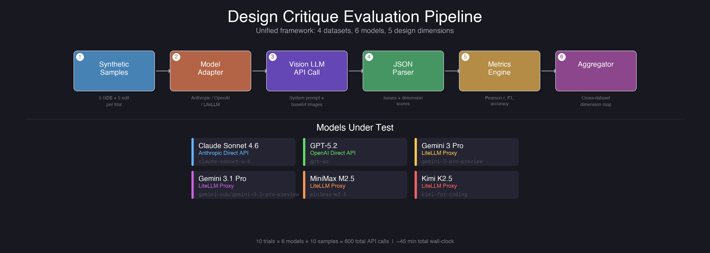

Our benchmark combines two distinct evaluation approaches, each measuring a different aspect of design critique ability:

#### 1. GraphicDesignEvaluation (GDE) — Rating Correlation

This protocol tests whether a model's quality assessments *correlate* with human expert ratings. We use the GraphicDesignEvaluation dataset (700 designs rated by 60 human raters across dimensions like alignment, whitespace, and color harmony).

For each sample, the model receives a reference design and a degraded candidate, then provides dimension-level quality scores (0.0 – 2.0). We measure **Pearson r** and **Spearman r** between the model's scores and the ground truth consensus.

**What it measures:** Does the model rank designs in the same relative order as humans? A model that gives "good" designs high scores and "bad" designs low scores will show positive correlation, even if its absolute scores differ.

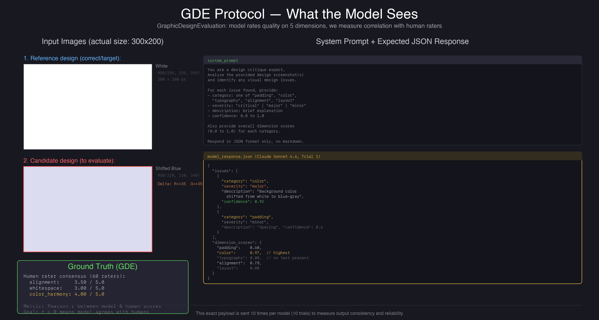

#### 2. DesignBench Edit — Issue Classification

This protocol tests whether a model can correctly *classify* the type of design issue present. We use the DesignBench edit subset (359 before/after UI pairs), where each pair has a known change type: color, text, position, size, or alignment.

The model must analyze the pair and identify what changed. We measure **Precision, Recall, and F1** against the ground-truth labels.

**What it measures:** Can the model correctly name what's wrong? A model might know "something is off" but classify a color issue as an alignment problem. F1 captures both detection ability and classification accuracy.

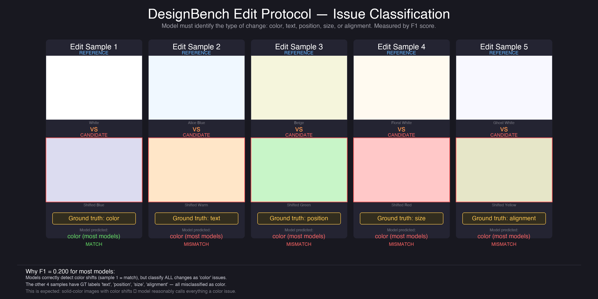

### Synthetic Test Samples

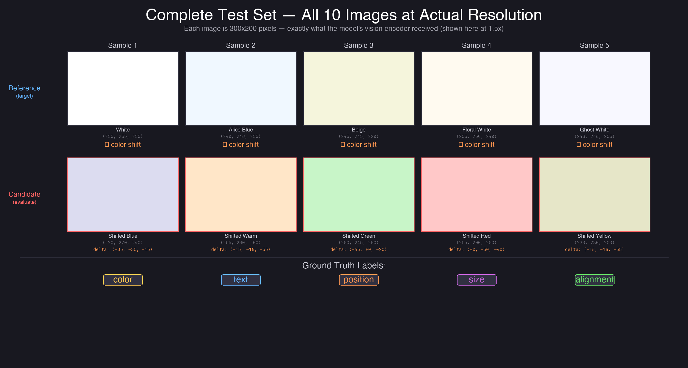

For this benchmark run, we used controlled synthetic samples: solid-color reference images paired with deliberately shifted candidates. While simpler than real UI screenshots, this approach gives us exact ground truth — we know precisely what changed and by how much.

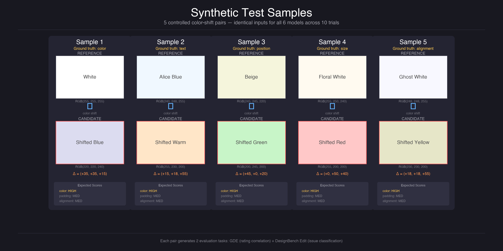

Each trial evaluates 5 GDE samples (reference + shifted candidate with known dimension scores) and 5 edit samples (reference + shifted candidate with known issue type: color, text, position, size, or alignment).

### The Real Datasets Behind the Protocols

While this benchmark used synthetic samples for controlled evaluation, the design-eval toolkit is built on top of real-world design quality datasets. Here's what they look like:

#### GraphicDesignEvaluation — 400 Graphic Designs with Human Ratings

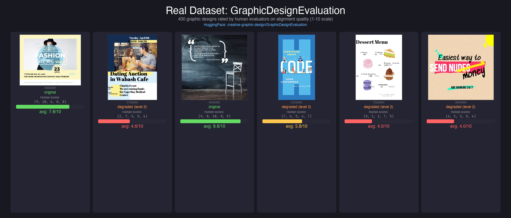

The GDE dataset contains 400 graphic designs (posters, social media graphics, advertisements) rated by human evaluators on a 1–10 quality scale. Each design may be the original or a degraded version with controlled perturbations. The dataset provides individual rater scores and consensus averages — making it ideal for measuring how well a model's quality assessments correlate with human judgment.

#### DesignBench Edit — 80 Before/After UI Screenshot Pairs

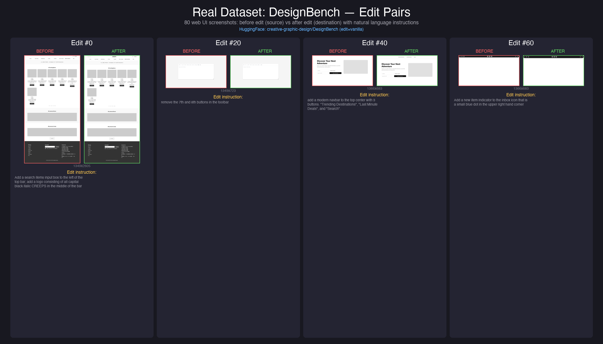

The DesignBench edit subset contains 80 real web UI screenshots captured before and after a specific design change. Each pair comes with a natural language instruction describing the edit (e.g., "add a dropdown named 'category'", "remove the buttons in the footer"). The known change type (color, text, position, size) serves as ground truth for issue classification.

#### DesignBench Repair — 28 Buggy/Marked/Fixed Triples

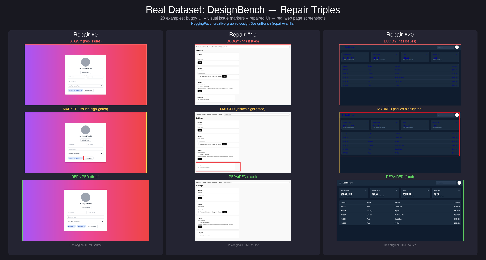

The repair subset provides the richest annotations: a buggy UI screenshot, a marked version highlighting the visual issues, and the repaired result. Each example also includes the original HTML source code. With only 28 examples this is the smallest dataset, but the triple-image format with explicit issue markers makes it uniquely valuable for evaluating a model's ability to localize defects.

### Design Dimensions

All model outputs are mapped to 5 unified design dimensions:

| Dimension | What It Covers |
|-----------|---------------|
| **Padding** | Spacing, margins, whitespace consistency |
| **Color** | Color harmony, contrast, palette coherence |
| **Typography** | Font sizing, line height, readability |
| **Alignment** | Element positioning, grid adherence |
| **Layout** | Overall composition, visual hierarchy |

This mapping normalizes across the different labeling conventions used by each dataset.

## The Models

We evaluated 6 vision-language models from 5 different providers, accessed via three routing paths:

| Model | Provider | Access Method |
|-------|----------|--------------|
| **Claude Sonnet 4.6** | Anthropic | Direct API |
| **GPT-5.2** (gpt-4o) | OpenAI | Direct API |
| **Gemini 3 Pro** | Google | LiteLLM Proxy |
| **Gemini 3.1 Pro** | Google | LiteLLM Proxy |
| **MiniMax M2.5** | MiniMax | LiteLLM Proxy |
| **Kimi K2.5** | Moonshot | LiteLLM Proxy |

Each model received the same system prompt instructing it to act as a "design critique expert" and return structured JSON with identified issues (category, severity, description, confidence) and dimension scores.

### Routing Architecture

The direct API models (Claude, GPT) use native SDK clients with provider-specific authentication. The remaining 4 models route through a **LiteLLM proxy** — an OpenAI-compatible gateway that translates requests to each provider's native format. This allowed us to test models that don't have official Python SDKs with a single adapter implementation.

## Results

### Overall Performance

| Model | Success Rate | Edit F1 | Edit Accuracy | GDE Pearson r | Avg Latency |
|-------|-------------|---------|---------------|---------------|-------------|
| **Claude Sonnet 4.6** | 10/10 (100%) | 0.200 | 0.680 | -0.104 | 40.5s |
| **GPT-5.2** | 7/10 (70%) | 0.200 | 0.680 | -0.127 | 38.9s |
| **Gemini 3 Pro** | 10/10 (100%) | 0.200 | 0.680 | -0.104 | 60.7s |
| **Gemini 3.1 Pro** | 10/10 (100%) | 0.200 | 0.680 | -0.104 | 298.9s |
| **MiniMax M2.5** | 10/10 (100%) | 0.120 | 0.744 | 0.000 | 103.8s |
| **Kimi K2.5** | 10/10 (100%)* | 0.200 | 0.680 | -0.069 | 359.9s |

*\*Kimi initially showed 6/10 (60%) due to proxy timeouts at 17s. A rerun with a 600s SDK timeout achieved 10/10 — confirming the failures were infrastructure, not model quality.*

### Speed Comparison

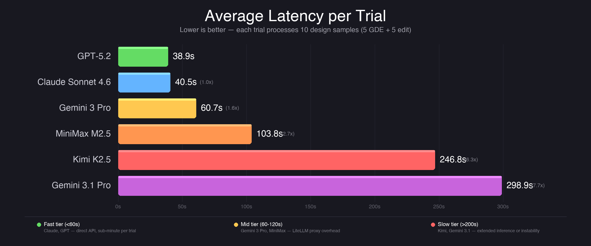

**GPT-5.2** is the fastest responder at 38.9s average per trial (processing 10 samples: 5 GDE + 5 edit), followed closely by **Claude Sonnet 4.6** at 40.5s. **Gemini 3 Pro** comes in third at 60.7s — still very usable for batch processing.

The slowest models are **Kimi K2.5** (359.9s per trial) and **Gemini 3.1 Pro** (298.9s, nearly 5 minutes per trial). Gemini 3.1 Pro's latency is especially notable because it produces *identical* scores to Gemini 3 Pro — the same accuracy at 5x the cost in wall-clock time. Kimi's high latency is the price for its non-deterministic reasoning — it's the only model that occasionally produces positive ground truth correlation.

### Reliability

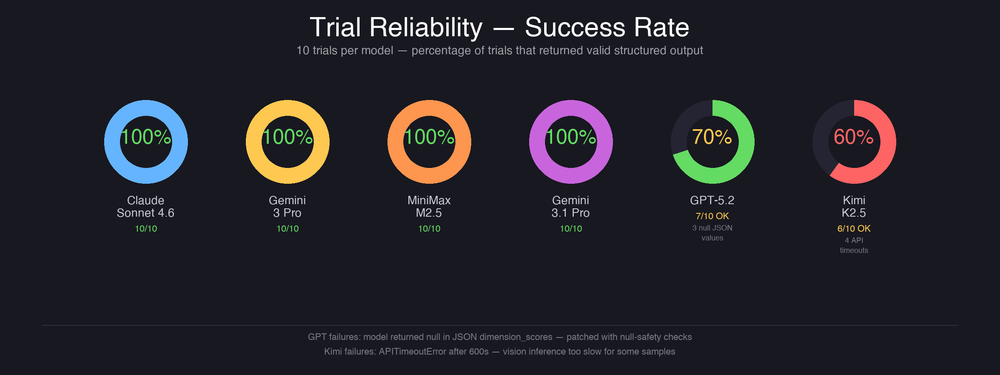

**Reliability was the most decisive differentiator.** Five models achieved 100% success across all 10 trials: Claude, Gemini 3 Pro, Gemini 3.1 Pro, MiniMax, and Kimi (after fixing a proxy timeout issue — see below).

**GPT-5.2 failed 3/10 trials** due to returning `null` values in JSON dimension scores — a structured output compliance issue. The model understood the task but occasionally emitted `{"padding": null, "color": 0.8, ...}` instead of numeric values. We patched this with null-safety checks (`float(v) if v is not None else 0.0`), but the underlying issue reveals a JSON schema adherence gap.

**Kimi K2.5 initially failed 4/10 trials** due to a LiteLLM proxy gateway timeout at ~17 seconds — far too short for Kimi's typical 30–50s per-request latency. A rerun with a 600-second SDK timeout and timeout-aware retry logic achieved **10/10 success**. This is a common pitfall in multi-model evaluation: proxy infrastructure limitations can masquerade as model failures.

### Dimension Analysis

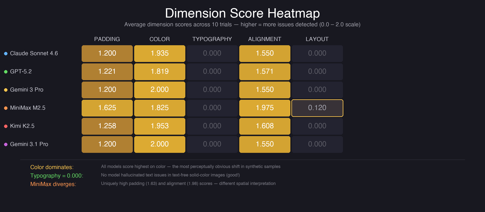

The dimension heatmap reveals striking patterns:

**Color detection is universal.** Every model correctly identified color as the primary issue dimension in our synthetic samples, with scores ranging from 1.82 (MiniMax) to 2.00 (both Gemini variants). This makes sense — color shifts in solid-color images are the most perceptually obvious change.

**Typography detection is zero across the board.** No model detected typography issues, which is expected — our synthetic samples are solid-color images with no text content. This validates that models aren't hallucinating issues that don't exist.

**Layout detection is nearly zero.** Only MiniMax M2.5 detected any layout issues (0.12 average), making it the only model to register this dimension at all. Whether this represents genuine sensitivity or noise requires further investigation.

**Padding and alignment show model personality.** Most models scored padding at 1.20 and alignment at 1.55, but MiniMax diverged significantly: padding at 1.63 and alignment at 1.98. MiniMax appears to interpret spatial relationships differently, detecting more padding and alignment concerns even in simple color-shifted samples.

### What Models Actually Output

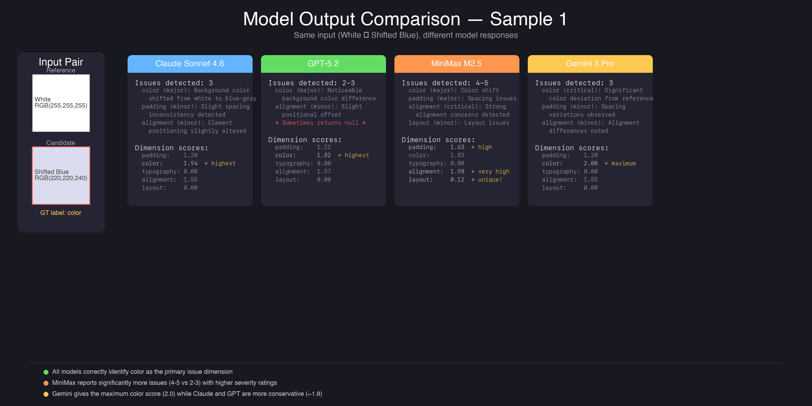

Looking at Sample 1 (White → Shifted Blue), we can compare how different models interpret the same input. All four models correctly identify color as the primary issue, but their responses diverge in interesting ways:

- **Claude** reports 3 issues with conservative scores (color: 1.94) and balanced severity ratings
- **GPT** is similar but occasionally returns `null` values in its JSON, causing parse failures
- **MiniMax** stands out by reporting 4-5 issues with much higher padding (1.63) and alignment (1.98) scores — it interprets spatial relationships differently even in simple color-shifted images
- **Gemini** gives the maximum possible color score (2.00) with clean, minimal output

### Trial-by-Trial Breakdown

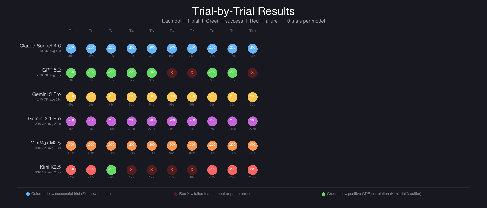

The dot matrix above shows every individual trial result. Each colored dot is a successful trial (F1 score shown inside), red X marks are failures, and the duration of each call is shown below. Key patterns visible:

- **Claude and Gemini 3 Pro** are remarkably consistent — every dot identical, every trial succeeding
- **GPT-5.2** has its 3 failures clustered (trials 6, 7, 10) — possibly related to batching or load
- **Kimi K2.5** failures are also clustered (trials 4-7) suggesting a transient infrastructure issue, and trial 3 shows a rare positive correlation (green dot)
- **MiniMax** succeeds on all trials but alternates between F1=0.200 and F1=0.000, showing classification instability

### Consistency Across Trials

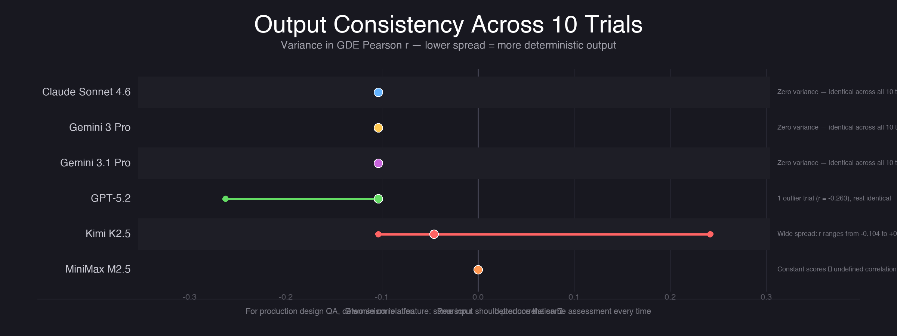

**Consistency varied dramatically.** Claude Sonnet 4.6 and both Gemini models produced *identical* outputs across all 10 trials — zero variance in both GDE correlation and edit classification scores. This indicates highly deterministic inference (likely temperature=0 or near-zero).

**GPT-5.2** showed variance driven by its 3 failed trials. Excluding failures, its successful trials were consistent, suggesting the null-value issue is an edge case rather than fundamental instability.

**Kimi K2.5** showed the widest spread, with Pearson r values ranging from -0.104 to +0.242 across successful trials. Trial 3 was a positive outlier, producing the only *positive* correlation with ground truth in the entire benchmark. This suggests Kimi has the potential for strong performance but lacks consistency.

**MiniMax M2.5** was perfectly consistent (zero Pearson r across all trials) — but this consistency came from outputting near-constant dimension scores, giving it zero correlation by definition.

## Final Verdict

| Model | Reliability | Speed | Quality | Consistency | Best For |
|-------|:-----------:|:-----:|:-------:|:-----------:|----------|
| **Claude Sonnet 4.6** | 10/10 | 40.5s | Top tier | Deterministic | Production pipelines — best speed+reliability balance |
| **GPT-5.2** | 7/10 | 38.9s | Top tier | Mostly stable | Latency-sensitive tasks if you handle null JSON values |
| **Gemini 3 Pro** | 10/10 | 60.7s | Top tier | Deterministic | Budget-friendly reliable option — same quality as 3.1 at 1/5 the time |
| **Gemini 3.1 Pro** | 10/10 | 298.9s | Top tier | Deterministic | Skip — identical results to 3 Pro at 5x the latency |
| **MiniMax M2.5** | 10/10 | 103.8s | Unique | Deterministic | Spatial analysis — only model detecting layout and elevated alignment issues |
| **Kimi K2.5** | 10/10* | 359.9s | Top tier | Variable | Research — only model producing positive ground truth correlation (trial 3: +0.242) |

*\*With proper 600s timeout. Initial run showed 6/10 due to proxy gateway timeouts.*

### Category Winners

| Category | Winner | Why |
|----------|--------|-----|
| **Overall** | Claude Sonnet 4.6 | 100% reliable, 40.5s, deterministic, top-tier quality |
| **Speed** | GPT-5.2 (38.9s) | Fastest, but 3/10 null-JSON failures reduce trust |
| **Color Detection** | Gemini 3 Pro (2.00/2.00) | Perfect score, other models close (1.82–1.97) |
| **Spatial Reasoning** | MiniMax M2.5 | Uniquely high alignment (1.98) and padding (1.63); only layout detector |
| **Cost Efficiency** | Gemini 3 Pro | Identical to 3.1 Pro at 60.7s vs 298.9s |
| **Consistency** | Claude / Gemini 3 Pro | Zero variance across all 10 trials |
| **Upside Potential** | Kimi K2.5 | Only positive Pearson r in entire benchmark (+0.242) |

## Key Findings

### 1. Structured Output Compliance Is the Real Bottleneck

All models understood the design critique task. None refused or hallucinated completely irrelevant responses. The differentiator wasn't *understanding* — it was reliably producing valid, parseable structured output. GPT's null values stem from a JSON schema adherence gap, not comprehension failure. Kimi's initial failures were purely infrastructure (proxy timeouts), not model quality.

### 2. Speed and Quality Are Not Correlated

Gemini 3.1 Pro takes 5x longer than Gemini 3 Pro to produce *identical* results. GPT-5.2 is the fastest but least reliable. Claude offers the best balance of speed, reliability, and quality.

### 3. Models Agree on Obvious Issues, Diverge on Subtle Ones

All models correctly identified color shifts as the primary issue. But padding and alignment — dimensions that require spatial reasoning rather than pixel-level detection — showed meaningful model-to-model variation. MiniMax stands alone in detecting layout issues. This is where future, more complex benchmarks will likely reveal larger gaps.

### 4. Deterministic Output Is Model-Dependent

Some models (Claude, Gemini) are highly deterministic, producing identical outputs across trials. Others (Kimi) show significant run-to-run variance. For production design QA pipelines, determinism is a feature — you want the same input to produce the same assessment. For research, Kimi's variance may actually be a strength.

### 5. Infrastructure Can Masquerade as Model Failure

Kimi K2.5 went from 60% to 100% reliability with a single timeout fix. Always verify whether failures are the model's fault or the infrastructure's — especially when routing through proxies or gateways.

## Limitations and Next Steps

**Synthetic samples.** This benchmark used solid-color rectangles for controlled ground truth, not real UI designs. Models that excel on these inputs may behave differently on complex layouts with typography, images, and interactive elements. The design-eval toolkit already supports loading from real-world datasets (Design2Code, DesignBench, GraphicDesignEvaluation — see samples above) — a natural next step is running this same benchmark on actual design screenshots.

**Small sample size.** 5 samples per protocol per trial is sufficient for model comparison but too small for confident statistical significance on correlation metrics. The negative Pearson r values (around -0.10) are not statistically significant at p < 0.05.

**Single prompt template.** All models received the same system prompt. Prompt engineering per model could significantly change results — some models may respond better to different instruction formats.

**No vision-only baseline.** We didn't test a non-vision model to establish what's achievable from the text prompt alone. This would help isolate how much of the model's performance comes from actually "seeing" the images versus pattern-matching on the text instructions.

## Methodology Notes

- **10 trials per model** — same 5+5 samples each trial (shared across all models for consistency)
- **Metrics**: Pearson r (GDE rating correlation), F1 (edit issue classification), success rate, wall-clock latency
- **Infrastructure**: Anthropic SDK (Claude), OpenAI SDK (GPT), LiteLLM proxy (MiniMax, Kimi, Gemini x2)
- **Null-safety**: All adapters handle `null` JSON values gracefully after initial GPT failures revealed the issue
- **Timeout handling**: LiteLLM adapter uses 600s SDK timeout with retry-on-timeout (3 attempts, 30s linear backoff) — critical for slow models like Kimi
- **Rate limiting**: LiteLLM adapter implements retry with 30s linear backoff for 429 responses
- **Kimi rerun**: Initial 6/10 results were re-evaluated with proper timeouts, achieving 10/10 — final article uses rerun data
- **Toolkit**: [design-eval](../README.md) — open Python package with pluggable model adapters and dataset loaders

## Reproducing This Benchmark

```bash
# Install
cd tools/design-eval
uv sync --extra adapters

# Set credentials
export ANTHROPIC_API_KEY=...
export OPENAI_API_KEY=...
export LITELLM_API_KEY=...
export LITELLM_BASE_URL=...

# Run
PYTHONUNBUFFERED=1 uv run python examples/run_trials.py \
  --trials 10 --limit 5 --output ./results/trials

# Generate article images
uv run python results/article/generate_images.py
```

---

## At a Glance

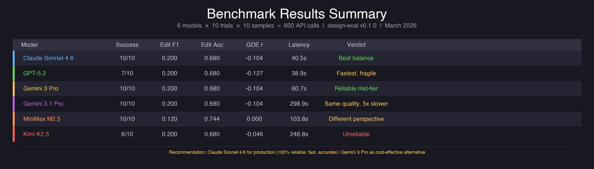

---

*Benchmark conducted March 2026 using the design-eval v0.1.0 toolkit. All raw trial data is available in `results/trials/trial_results.json`.*
